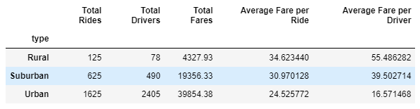
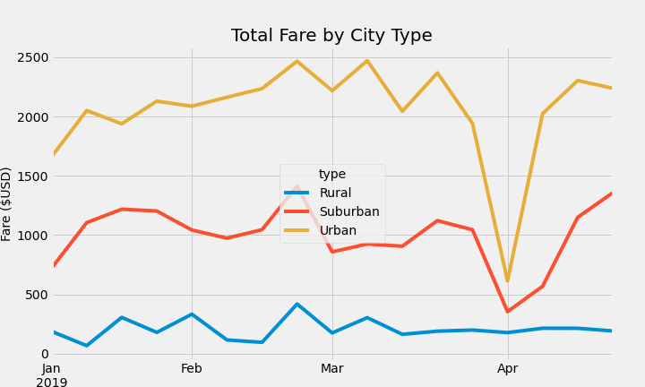

# PyBer_Analysis
## Overview of the Analysis
For this analysis, Python Scripts were used to perform an exploratory analysis of Pyber ridership data. Using Matplotlib and Pandas, various data frames and visuals were created to develop insights regarding PyBer's service line. Using these insights, PyBer plans to improve affordability and accesibility for underpriviledged areas. 

## Results
Three city types were compared for this analysis: Urban, Suburban, and Rural. Additionally, ridership data can be analyzed based on three metrics given to us in the data sets: Ride Count, Driver Count, and Fare Amount.

A table summarizing the results can be seen below:

Figure 1

Figure 1 shows that Pyber is most used in urban areas and least used in rural areas since it has the highest amount of total rides and lowest amount of total rides in urban areas and rural areas, respectively.. Additionally, Pyber has its highest number of drivers in urban areas and lowest number of drivers in rural areas. However, the average fare per ride and the average fare per driver are the lowest in urban areas and the highest in rural areas.

Additionally, we are focusing on how fares may change by city type per the course of the year. In this analysis, we are focusing on the time between January and April of 2019.

Figure 2

 
 Per Figure 2, the total fare amount remains relatively consistent throughout the year. However, urban and suburban areas plummet at the beginning of April.

## Summary
In order to improve accessibility and affordability of PyBer to underprivileged areas, the company can take action internally and externally. One thing Pyber can do is charge urban areas more money to increase profits. Some of these profits can be put aside to use in funding  discounts in rural locations to incentivize the use of Pyber in more remote locations. Another thing Pyber can do is change how a ride fare is determined. As per the data, the average fare per ride is the largest in rural areas and lowest in urban areas. SInce rural areas are more spread out than urban areas, this suggests that pricing may be measured by distance traveled. It would be illogical to not base a ride sharing service on distance traveled; however, using a weighted pricing algorithm such as pricing based on time, distance, and other factors to level the pricing dicrepancy. One last thing that PyBer can do is provide a monetary incentive to drivers if they drive a certain amount of miles, thus encouraging more drivers to pursue business in less populated areas.
